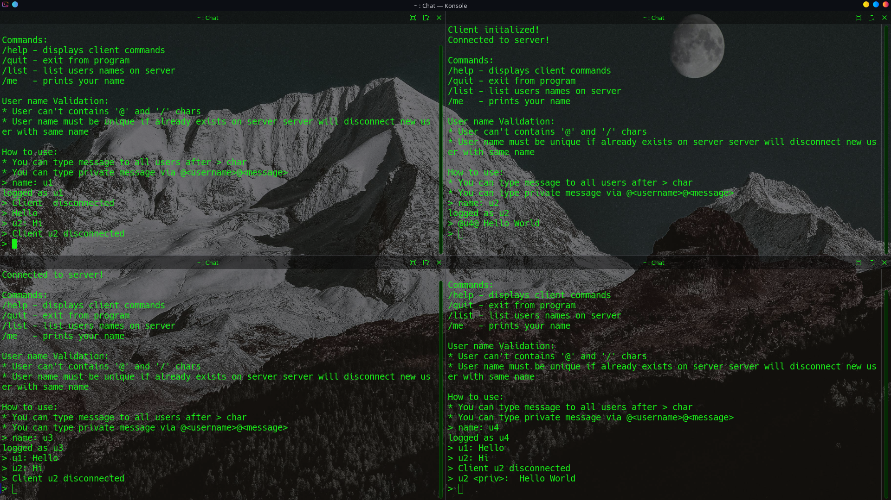

# Network
## About 
It is simple internet interface for easier working with networking in c/c++.
Library is written in c. Useful and lightweight. Core idea was assignment at university with networking. All functions works on **no-blocking mode** Added simple chat.


## TOC
- [About](#about)
- [TOC](#toc)
- [Screenshots](#screenshots)
- [Installation](#installation)
- [Usage](#usage)
- [Full Example](#full-example)
- [Features](#features)
- [TODO (Future Features)](#todo-future-features)
- [License](#license)
- [Prerequisites](#prerequisites)


## Screenshots

<table>
  <tr>
    <td align="center">
      <a href=".github/SS//Chat.png">
        <br>
      </a>
    </td>
  </tr>
</table>


## Installation
### As Lib
1. clone repository
```bash
  git clone https://github.com/Daynlight/Network.git
```
2. add subdirectory
```cmake
  add_subdirectory(Network)
```
3. add to your project
```cmake
  target_link_libraries(App Network)
```
### Chat Example
1. clone repository
```bash
  git clone https://github.com/Daynlight/Network.git
```
2. compile via cmake
```bash
  # you need to change address in Example/Macro.h
  # in default it uses my google cloud server soo many 
  # users can access it

  mkdir build
  cd build/
  cmake ..
```
3. run server
```bash
  ./../bin/Server
```
4. run client
```bash
  ./../bin/Client
```


## Usage
### Info and Recommend Usage
- Server and Client works on **no-blocking sockets**. You need loop for receiving data.

- For **Video/Music etc.** data are sended as **char buffer** and on client side are used in proper way.

- Best way to use it is making some custom format. for example make first **byte 255 or more** are always operations **register,login etc.** then you check this first byte and make operation based on this.

- Good practice is to **optimize** buffer before sending it. Also good idea is **compression** and **encryption** [CCrypt](https://github.com/Daynlight/CCrypt).

- After client connect it sets his socket to **no-blocking**


### Server
#### Functions
- ```network_server_init``` - initialize server
- ```network_server_destroy``` - destroy server
- ```network_server_listen``` - tcp listen for users connections
- ```network_server_read``` - tcp read data from client
- ```network_server_send``` - tcp send data to client
- ```network_get_client_ip``` - get ip from socket
- ```network_server_read_from```  - udp read data from client
- ```network_server_send_to```  - tcp send data to client


### Client
#### Functions
- ```network_client_init``` - initialize client
- ```network_client_destroy```  - destroy client
- ```network_client_connect```  - tcp connect client to server
- ```network_client_read``` - tcp read data from server
- ```network_client_send``` - tcp send data to server
- ```network_client_read_from``` - udp read data from server  
- ```network_client_send_to```  - udp send data to server
- ```network_client_send_request``` - udp combination of send and read

### Server/Client
- ```network_check_if_empty_message``` - check if message is not empty

### NetworkModes
- ```TCP``` - tcp protocol
- ```UDP``` - udp protocol

### TCP Mode 
- In tcp mode client and server creates connection via ```listen``` and ```connect```
- ```listen``` returns user socket you should implement your own client manager
- Data are exchanged via ```send``` and ```read``` functions for ```client``` and ```server```
- You need specify maximal message size
- If message is to long then send up to max size

### UDP Mode
- In udp mode client and server don't create connection so you don't use ```listen``` and ```connect```
- You also don't need to create client manager
- Data are exchanged via ```send_to``` and ```read_from```
- For client You can run ```request``` that is combination of ```send_to``` and ```read_from```
- For server when ```read_from``` You add reference to client and then when ```send_to``` use it
- You need specify maximal message size
- If message is to long then send up to max size

### Network Provider
- ```sock``` - socket id
- ```serv_addr``` - sockaddr_in for server
- ```mode``` - contains TCP/UDP mode used in socket

### NetworkCodes
- ```NODATA``` - send or read no data
- ```DISCONNECT``` - server or client is disconnecting
- ```NOCLIENT``` - no client to connect
- ```DNSERROR``` - can't find domain
- ```SOCKETERROR``` - can't create socket
- ```CONNECTERROR```  can't connect to server
- ```ERRORCODE``` - error when function called
- ```SUCCESS``` - function end up with success


## Full Example
### Server
```c

```

### Client
```c

```


## Features
- **Non-blocking I/O**: No need to wait for data to be read or sent; the program can continue executing while awaiting network events.
- **Multiple Client Handling**: The server can handle multiple client connections simultaneously.
- **Protocols**: TCP and UDP protocol
- **Cross-Platform**: Window and Linux supported.


## License
[GNU GENERAL PUBLIC LICENSE Version 2, June 1991](LICENSE)


## Prerequisites
- CMake 3.15 or higher
- Git (for cloning with submodules)
